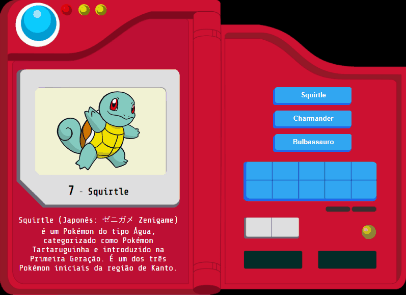

# Pokédex - Starters

### README Translations:
* [English](/README.en.md)
* [Portuguese](/README.md)

---

## 👨‍💻 O que foi desenvolvido:

  - Uma Pokédex que funciona com os pokémon iniciais.

:bulb: **Veja uma amostra a seguir:**

  

## O que eu aprendi com esse projeto:

- Sedimentar conhecimento sobre manipulação do DOM
- Como utilizar `data-attributes` para tornar o JS mais dinâmico
- Como incluir **música** em seus projetos neste código-fonte
- Como criar botões usando o Skeuomorphismo no CSS
